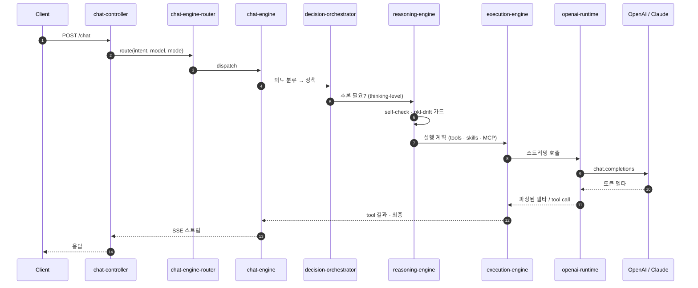
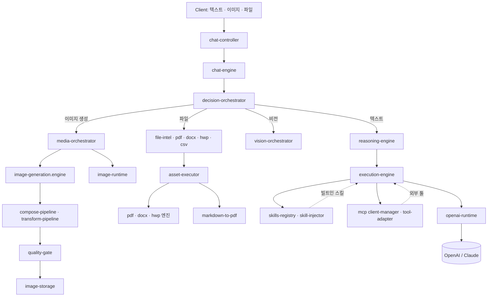

# YUA Backend

멀티 런타임 AI 백엔드. 채팅, 추론, 에이전트, 멀티모달, MCP, 스킬을 한 TypeScript 서비스에서 다룬다.

`TypeScript` · `Node 20` · `Express` · `Postgres` · `Redis` · `OpenAI` · `MCP`

> 1인 개발. 4개월. 약 1,500개 파일. [YUA](https://github.com/yuaone) 운영 중.
>
> 🇺🇸 [English README](./README.md)

---

## 무엇을 하는 시스템인가

- **Chat** — 스트리밍, 다중 엔진 라우팅, 레거시 어댑터
- **Reasoning** — self-check, drift 가드, thinking-level 조정
- **Agents** — 샌드박스 실행, 시크릿 탐지, 감사 로깅
- **Multimodal** — 이미지 생성, 비전, 파일 분석 (pdf · docx · hwp · csv)
- **Tools** — MCP 클라이언트, 빌트인 스킬, 검색 인젝션
- **OpenAI runtime** — 스트리밍 completion, tool call, function payload

래퍼가 아니다. HTTP 진입부터 LLM 토큰 스트림까지 풀 파이프라인이 이 레포에 다 있다.

---

## 아키텍처 — 텍스트 요청



## 아키텍처 — 멀티모달 요청



---

## 핵심 모듈

| 경로 | 역할 |
|------|------|
| `src/control/chat-controller.ts` | HTTP 진입, SSE 스트리밍 |
| `src/ai/chat/chat-engine-router.ts` | 의도 / 모델 기반 엔진 선택 |
| `src/ai/engines/chat-engine.ts` | 메인 채팅 디스패치 |
| `src/ai/decision/decision-orchestrator.ts` | 의도 → 정책 매핑 |
| `src/ai/reasoning/reasoning-engine.ts` | self-check, pkl-drift, thinking-level |
| `src/ai/execution/execution-engine.ts` | Tool / Skill / MCP 실행 |
| `src/ai/chat/runtime/openai-runtime.ts` | OpenAI 스트리밍 런타임 |
| `src/ai/chat/runtime/prompt-runtime.ts` | 프롬프트 조립 런타임 |
| `src/ai/image/media-orchestrator.ts` | 멀티모달 디스패치 |
| `src/ai/asset/execution/` | 문서 · 이미지 자산 파이프라인 |
| `src/connectors/mcp/` | MCP 클라이언트, 툴 어댑터, 프롬프트 빌더 |
| `src/skills/` | 스킬 레지스트리 · 검색 · 인젝터 |
| `src/agent/security/` | 샌드박스, 시크릿 탐지, 감사 로거 |

`src/ai/chat/runtime/` 아래 7개 런타임 — chat · code · context · image · safety · openai · prompt.

## Self-QA

`qa-reports/2026-04-22/` — 6개 모듈 자체 감사:
- `01_openai_runtime.md`
- `02_prompt_builder.md`
- `03_prompt_runtime.md`
- `04_context_runtime.md`
- `05_chat_engine.md`
- `06_execution_engine.md`

---

## 스택

- **Runtime** Node 20, TypeScript 5
- **Web** Express, Swagger
- **Storage** Postgres, MySQL, Redis
- **AI** OpenAI SDK, MCP, 자체 런타임
- **Process** PM2, Docker

## 프로젝트 구조

```
src/
  ai/
    chat/         # 7개 런타임 + 엔진 + 라우터
    decision/     # decision orchestrator + assistant
    reasoning/    # reasoning engine + self-check + drift
    execution/    # execution engine
    image/        # media orchestrator + vision
    asset/        # 문서 + 이미지 파이프라인
    memory/       # cross-memory, runtime memory
  agent/          # executor, session manager, security
  control/        # HTTP 컨트롤러
  connectors/mcp/ # MCP 클라이언트 + 툴 어댑터
  skills/         # 레지스트리 + 검색 + 인젝터
  routes/         # 라우트 정의
qa-reports/       # 모듈별 자체 감사
data/training/    # 학습 데이터
migrations/       # SQL 마이그레이션
```

---

## 상태

OSS 아직 아님. 프로덕션 코드, 일부 공개. 라이선스 정리 중.

## 저자

전체를 처음부터 끝까지 직접 만들었다. `chat-controller`부터 `openai-runtime`까지, 이미지 생성·파일 분석·MCP·스킬까지 한 사람, 4개월.
백엔드 / AI 런타임 / 에이전트 인프라 채용이라면 연락 주세요.
