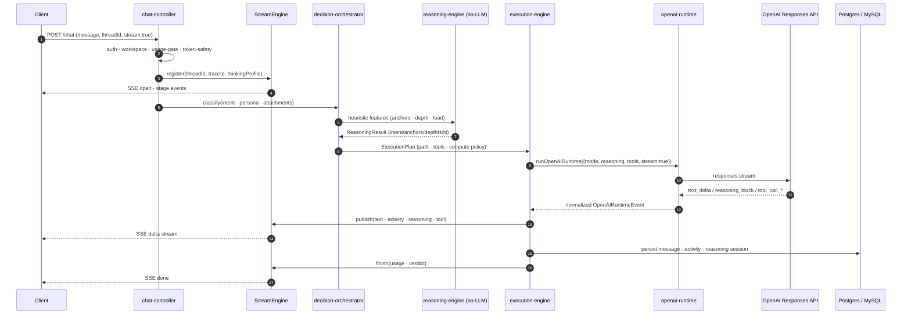
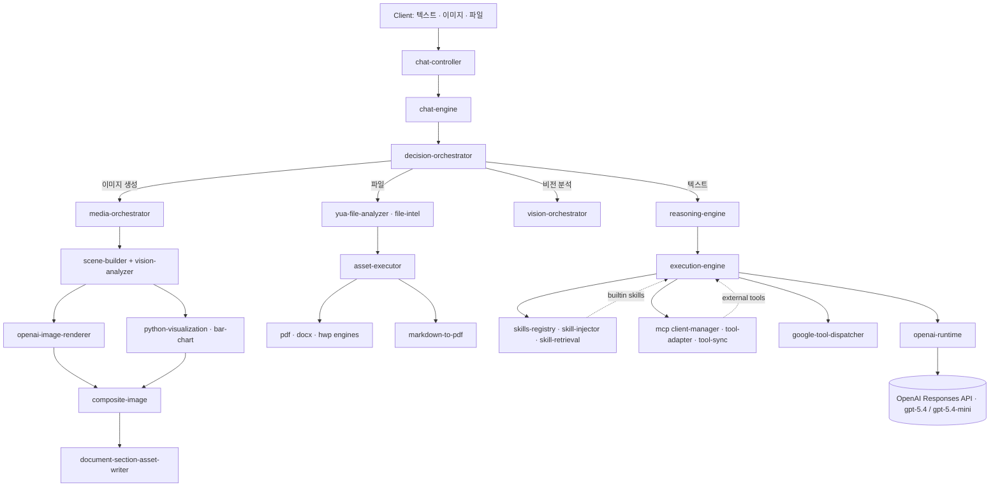

# YUA Backend

YUA의 멀티런타임 AI 백엔드입니다. 채팅·추론·에이전트·멀티모달·MCP·스킬을 하나의 TypeScript 서비스에서 다룹니다.

`TypeScript` · `Node 20` · `Express` · `Postgres` · `MySQL` · `Redis` · `OpenAI Responses API` · `MCP`

> 1인 개발. 4개월. 약 1,500개 파일. 운영 중입니다.
>
> 🇺🇸 [English README](./README.md)

---

## 무엇이 들어있나요

`openai.chat.completions` 를 감싼 래퍼가 아닙니다. HTTP 진입부터 LLM 토큰 스트림까지 전 구간을 직접 짠 시스템이고, 다음이 모듈로 분리돼 있습니다.

- **Chat 진입**: [`chat-controller`](https://github.com/yuaone/yua-backend/blob/main/src/control/chat-controller.ts) 가 `/chat` POST 를 받아 SSE 스트림 세션을 엽니다.
- **6가지 OutMode**: FAST · NORMAL · DEEP · SEARCH · RESEARCH · ENGINE_GUIDE — 각각 별도 path 핸들러로 분기됩니다.
- **Decision Orchestrator**: 의도 · 정책 · 경로 · 메모리 의도를 한 곳에서 결정합니다. ChatEngine 은 결정을 내리지 않고, 결과를 받아 path 로 컴파일하기만 합니다.
- **Reasoning Engine**: LLM 호출이 0입니다. 순수 함수 + weighted heuristic 으로 turn intent / depth / cognitive load / flow anchor 를 산출합니다.
- **Execution Engine**: 스트림 라이프사이클을 책임지고, tool / skill / MCP 호출, verifier loop, 응답 이어쓰기, 멀티모달 디스패치까지 여기서 처리합니다.
- **OpenAI Runtime**: OpenAI **Responses API** (2026.01 신규) 정식 타입으로 호출합니다. `system / developer / user` 분리, `reasoning.effort` 6단계, `verbosity` 3단계, JSON schema 출력 가능.
- **Multimodal**: 이미지 생성 (semantic + chart 합성) · 비전 분석 · 파일 분석 (pdf · docx · hwp · csv) · markdown→pdf 렌더.
- **Tools/Skills/MCP**: OpenAI built-in tools, 자체 yua-tools, MCP 외부 툴, retrieval 기반 skill injection.
- **Telemetry & Self-Check**: raw event writer, failure surface aggregator, completion verdict engine, compute gate (비용/지연 한도).

---

## 요청이 어떻게 흐르나요

### 스트리밍 전송 방식 — SSE + Redis Pub/Sub

스트리밍은 **WebSocket 이 아니라 SSE (Server-Sent Events)** 입니다. 양방향이 필요 없고 (서버 → 클라이언트 단방향) 프록시·CDN 친화적이라 SSE 를 선택했습니다.

요청과 수신이 두 엔드포인트로 분리돼 있습니다.

- `POST /chat` — 메시지 제출. 응답은 작업 시작 ack 만 돌려주고 끝냅니다.
- `GET /stream?threadId=X` — 같은 스레드의 SSE 채널을 엽니다. `text/event-stream; charset=utf-8`, `Cache-Control: no-cache`, `X-Accel-Buffering: no` (nginx 버퍼링 차단) 헤더를 세팅하고, 15초마다 `: ping` keep-alive 를 보냅니다.

이 분리 덕분에 다음이 가능합니다.

- 새로고침해도 같은 `threadId` 로 다시 `/stream` 만 열면 진행 중인 응답을 이어 받을 수 있음
- 모바일이 백그라운드로 가도 작업은 계속되고, 돌아왔을 때 다시 구독
- 다중 디바이스에서 같은 스레드를 동시에 구독 가능

**Redis Pub/Sub 으로 수평 확장**

PM2 로 여러 인스턴스를 띄우면 `POST /chat` 을 받은 인스턴스와 `GET /stream` 을 받은 인스턴스가 다를 수 있습니다. 이 경우 in-memory 만으로는 이벤트가 전달되지 않습니다. 그래서 `StreamEngine.publish` 는 두 곳으로 동시에 보냅니다.

1. **in-memory subscribers** — 같은 인스턴스의 SSE 핸들러 (가장 빠름)
2. **Redis publisher** — 채널 `yua:stream:${threadId}` 로 publish

다른 인스턴스의 `redisSub` 가 같은 채널을 구독하고 있다가 메시지를 받으면 in-memory subscribers 로 fan-out 합니다. SSE 핸들러는 자기 인스턴스 in-memory 만 보면 되니 코드는 단순합니다.

```
[Instance A] POST /chat ─┐
                         │ StreamEngine.publish
                         ├─→ in-memory subs (A)
                         └─→ redisPub.publish("yua:stream:42")
                                       │
                            [Instance B] redisSub.on("message")
                                       │
                                       └─→ in-memory subs (B)
                                                  │
                                                  └─→ SSE write to client
```

**Redis 캐시**

Pub/Sub 외에 캐시 용도로도 씁니다.

- `yua:thread_title:cache:${threadId}` — 스레드 제목. DB write 성공 후에만 set 합니다 (캐시-DB 불일치 방지). 다음 조회는 Redis 가 우선.
- `yua:activity_title:jobs` — activity title 생성을 비동기 큐로 분리. 워커가 stream key 에서 꺼내 처리.
- `yua:activity_title:patch:${threadId}` — title patch 결과를 같은 스레드의 SSE 로 흘려보내는 별도 채널.

스트림 세션 자체 (state machine, AnswerBuffer, reasoning buffer 등) 는 in-memory 입니다. Redis 는 인스턴스 간 브로드캐스트와 명시적 캐시 키만 담당하고, 핫 패스에서 상태를 매번 fetch 하지 않습니다.

**SSE Frame 한 가지 주의**

한글이 UTF-8 에서 3바이트라 `res.write()` 가 두 번 나뉘면 멀티바이트 문자가 청크 경계에서 잘릴 수 있습니다. 그래서 `event:` 와 `data:` 를 한 string 으로 합친 뒤 `Buffer.from(frame, "utf-8")` 로 한 번에 write 합니다.

### 텍스트 채팅 1턴 — 단계별 설명



위 다이어그램의 ①~⑬을 풀어 설명하면 다음과 같습니다.

1. **요청 진입 (`chat-controller.handleChat`)**
   클라이언트가 `POST /chat` 으로 메시지를 보냅니다. `stream: true` 인 경우 SSE 모드로 진입합니다. 컨트롤러가 `traceId` (UUID) 를 발급해서 이후 모든 로그·이벤트에 같은 ID 가 따라붙도록 합니다.

2. **인증·워크스페이스·사용량 체크**
   `req.user` 와 `req.workspace` 를 검증한 뒤, `usage-gate` 가 워크스페이스 단위 사용량 한도를 확인합니다. 동시에 `token-safety` 가 입력 토큰이 컨텍스트 한도를 넘기지 않는지 검사합니다. 한 단계라도 막히면 SSE 를 열기 전에 401/402/413 으로 끊습니다.

3. **첨부 복구**
   첨부파일이 비어 있어도 직전 턴의 첨부 세션을 `file-session-repository` 에서 복구합니다. 사용자가 "앞에 올린 파일 요약해줘" 처럼 follow-up 을 보낼 때 다시 업로드하지 않아도 동작하도록 하기 위함입니다.

4. **SSE 세션 등록 (`StreamEngine.register`)**
   `threadId · traceId · thinkingProfile` 로 스트림 세션을 등록합니다. 이 시점부터 클라이언트는 `event: stage` 같은 진행 단계 이벤트를 실시간으로 받기 시작합니다.

5. **DecisionOrchestrator 진입**
   메시지 · 페르소나 · 첨부 메타 · 워크스페이스 컨텍스트를 입력으로 받아 다음을 결정합니다.
   - turn intent (질문/반응/연속/전환)
   - 응답 경로 (FAST/NORMAL/DEEP/SEARCH/RESEARCH/ENGINE_GUIDE)
   - 메모리 의도 (저장할지 / 참조할지)
   - tool gate (어떤 도구를 허용할지)
   - compute policy (모델 · reasoning effort · verbosity)

6. **ReasoningEngine 호출 — LLM 없이**
   DecisionOrchestrator 안에서 `ReasoningEngine` 을 동기 함수로 호출합니다. 가중치 휴리스틱과 코드 AST/수식 그래프 분석으로 flow anchor (`VERIFY_LOGIC`, `IMPLEMENT`, `BRANCH_MORE` 등 9종), depth hint, cognitive load 를 산출합니다. LLM 을 쓰지 않으니 결정론적이고 빠르며 비용이 들지 않습니다.

7. **ExecutionPlan 생성**
   결정 결과를 `ExecutionPlan` 으로 묶어 ChatEngine → ExecutionEngine 으로 넘깁니다. 이 시점부터 결정은 변경되지 않으며, 이후 모든 모듈은 plan 을 읽기만 합니다.

8. **ExecutionEngine 의 도구 준비**
   - `tool-assembly-cache` 에서 60초 TTL 캐시 조회 (도구 목록은 대화 중 잘 안 바뀝니다)
   - OpenAI built-in tools (web_search 등) + yua-tools + 활성 MCP 도구 + Google 도구를 한 번에 어셈블
   - skill retrieval (`skill-retrieval` → `skill-injector`) 로 현재 메시지에 맞는 top-N 스킬을 시스템 프롬프트에 주입

9. **OpenAI Responses API 호출 (`runOpenAIRuntime`)**
   OutMode 에 따라 모델을 고르고 (`gpt-5.4-mini` for FAST, `gpt-5.4` for 나머지), `reasoning.effort` · `verbosity` · 출력 포맷 (text 또는 json_schema) 을 정한 뒤 `responses.stream` 으로 호출합니다. 일반 `chat.completions` 가 아니라 신규 Responses API 입니다.

10. **이벤트 정규화 + SSE publish**
    Responses API server event 를 받아 다음 형태로 정규화합니다.
    - `text_delta` — 답변 토큰 delta
    - `reasoning_block` / `reasoning_summary_delta` — 추론 블록 (답변과 분리)
    - `tool_call_started/arguments_delta/done/output` — 도구 호출 라이프사이클
    - `activity` — web_search 같은 부가 활동
    - `usage` — 토큰 사용량
    각 이벤트를 `StreamEngine.publish` 로 SSE 에 흘립니다. 추론 블록은 답변 토큰과 분리해서 UI 가 별도 영역에 그릴 수 있게 합니다.

11. **Tool call 처리**
    LLM 이 tool 을 호출하면 `tool-runner` → 디스패처 (built-in / yua-tools / MCP / Google) 가 실행하고, 결과를 다시 LLM 으로 돌려보내 응답 이어쓰기를 진행합니다. 인용 (citation) 은 `createCitationStreamParser` 가 스트림에서 실시간 파싱해 source chip 으로 같이 송출합니다.

12. **Verifier loop + Continuation**
    응답이 끝나면 `runVerifierLoop` 가 출력 품질을 확인하고, 필요하면 재시도합니다. 응답이 잘렸다면 `continuation-decision` → `buildContinuationPrompt` 로 prompt 를 재구성해 이어 씁니다.

13. **저장 + 종료**
    최종 응답을 Postgres 에 저장합니다 (`message · activity · reasoning_session · asset` 테이블). 같은 트랜잭션에서 `updateConversationSummary` 가 conversation summary 를 갱신해 다음 턴이 짧은 컨텍스트로 시작할 수 있게 합니다. 마지막으로 `StreamEngine.finish` 가 SSE `done` 이벤트와 함께 세션을 정리합니다. 어떤 분기에서 에러가 나도 try/catch 로 `finish()` 가 항상 호출되므로 좀비 세션이 생기지 않습니다.

### 멀티모달 (이미지 생성·비전·파일)



DecisionOrchestrator 가 입력 종류를 보고 분기합니다.

- **이미지 생성**: [`media-orchestrator`](https://github.com/yuaone/yua-backend/blob/main/src/ai/image/media-orchestrator.ts) 가 두 갈래로 나눕니다. 텍스트 의미만 있으면 `scene-builder` → `openai-image-renderer` 로 의미 이미지를 만들고, 데이터 (`computed.series`) 가 같이 오면 Python 시각화 스크립트 (`bar-chart`) 로 차트를 그린 뒤 `composite-image` 로 합성합니다. 같은 입력은 hash 로 dedupe (`findCompositeByHash`).
- **비전 분석**: [`vision-orchestrator`](https://github.com/yuaone/yua-backend/blob/main/src/ai/vision/vision-orchestrator.ts) 가 첨부 이미지를 분석해 hint 로 scene 에 주입하거나 단독 분석을 수행합니다.
- **파일 분석**: `yua-file-analyzer` 진입 → 확장자별 엔진 (pdf · docx · hwp · csv) 으로 분기. 결과를 다시 `markdown-to-pdf` 로 PDF 화할 수 있습니다.

각 단계의 진행 상황은 `StreamEngine.publish({event: "stage", stage: ANALYZING_IMAGE})` 같은 stage 이벤트로 SSE 에 실시간 송출됩니다.

---

## 핵심 설계 포인트

### Stream Engine

스트림은 한 곳에서만 만듭니다. 컨트롤러는 `register()` 로 세션을 열고 `finish()` 로 닫기만 합니다. 토큰을 직접 잘라 보내거나, publish 루프로 스트림을 흉내내거나, ExecutionEngine 을 우회해서 텍스트를 만드는 패턴은 코드 상에서 막아 놓았습니다. 좀비 세션이 한 번 새면 디버깅이 지옥이라 라이프사이클 강제는 일찍 잡았습니다.

### Decision Orchestrator

`decision-orchestrator.ts` 가 의도·정책·경로·메모리 의도를 결정합니다. ChatEngine 도, ExecutionEngine 도, 다른 모듈도 여기서 만든 결과를 받아 쓰지, 직접 분류하지 않습니다. 학습은 threshold 만 움직이고 rule 자체나 모델 retraining 은 하지 않습니다. 모든 효과는 `RAW_EVENT` 로 기록돼 사후 분석 가능합니다.

### Reasoning Engine — LLM 안 씀

`reasoning-engine.ts` 는 의도적으로 LLM 호출이 없습니다. async 도 아닙니다. weighted heuristic 으로:

- turn intent (`QUESTION`, `REACTION`, `AGREEMENT`, `CONTINUATION`, `SHIFT`)
- depth hint (`shallow` / `normal` / `deep`)
- cognitive load (`low` / `medium` / `high`)
- flow anchor 9종 (`VISION_PRIMARY`, `REFINE_INPUT`, `EXPAND_SCOPE`, `VERIFY_LOGIC`, `COMPARE_APPROACH`, `IMPLEMENT`, `SUMMARIZE`, `NEXT_STEP`, `BRANCH_MORE`)

코드 입력이 있으면 `code-ast-engine`, 수식이 있으면 `math-graph-engine` 으로 feature 를 추가합니다. anchor 는 다음 흐름 제안용일 뿐 강제하지 않고, 문장 생성도 하지 않습니다.

LLM 없이 동작해야 빠르고 결정론적이며 비용이 안 듭니다.

### OpenAI Responses API

`openai-runtime.ts` 가 OpenAI **Responses API** 정식 타입 (`ResponseCreateParamsStreaming`, `ResponseTextDeltaEvent`, `ResponseFunctionCallArgumentsDeltaEvent` 등) 을 그대로 씁니다. `chat.completions` 가 아닙니다.

- 모델 라인업: `gpt-5.4-mini` (FAST), `gpt-5.4` (NORMAL/SEARCH/DEEP/RESEARCH)
- `reasoning.effort`: `none` / `minimal` / `low` / `medium` / `high` / `xhigh`
- `reasoning.summary`: `auto` / `concise` / `detailed`
- `verbosity`: `low` / `medium` / `high`
- 출력 포맷: text 또는 json_schema (strict 지원)
- 추론 토큰과 답변 토큰은 분리해서 흘립니다. 추론은 답변 스트림에 섞지 않습니다.

### Execution Engine

`execution-engine.ts` 가 4,000줄짜리 실행 코어입니다.

- **스트림 라이프사이클**: FINAL → DONE → CLEANUP 순서로만 종료합니다.
- **Tool routing**: OpenAI built-in / yua-tools / MCP / Google tools 를 한 디스패처에서 처리합니다.
- **Verifier loop**: `runVerifierLoop` 가 출력에 자체 검증 루프를 걸어 부족하면 재시도합니다.
- **Continuation**: 응답이 잘렸는지 판단하고 (`continuation-decision`) prompt 를 재구성해서 (`buildContinuationPrompt`) 이어 씁니다.
- **Tool assembly cache**: 도구 목록은 대화 중 잘 안 바뀌니 60초 TTL 로 캐시합니다.
- **Citation parser**: 응답 내 인용을 스트림에서 실시간 파싱해 source chip 으로 표시합니다.
- **Activity aggregator**: tool call · web search · file read 같은 활동을 한 곳에서 모읍니다.

### Compute Gate & Token Safety

요청이 LLM 까지 닿기 전에 게이트를 통과합니다.

- `usage-gate`: 워크스페이스 사용량 한도
- `compute-policy`: 모델 · reasoning effort · 허용 도구를 정책으로 결정
- `compute-gate`: 동시성 / 지연 / 비용 한도
- `token-safety`: prompt 토큰이 컨텍스트 한도를 넘기 전에 차단

### Tools / Skills / MCP

- **OpenAI built-in tools**: `openai-tool-registry` 에서 schema 빌드, `web_search` 같은 OpenAI 호스트 툴 활성화
- **MCP**: `mcp/client-manager` 가 사용자별 세션 관리, `tool-adapter` 가 OpenAI tool schema 로 변환, `tool-sync` 가 스레드 단위로 활성 도구 결정
- **Skills**: `skills-registry` (정의) → `skill-retrieval` (top-N 검색) → `skill-injector` (시스템 프롬프트 주입)
- **Google**: `google-tool-dispatcher` 로 Gmail · Calendar · Drive 통합

---

## 메모리와 컨텍스트 주입

### 메모리 레이어 (4단)

[`src/ai/memory/index.ts`](https://github.com/yuaone/yua-backend/blob/main/src/ai/memory/index.ts) 에서 메모리 모듈을 한 허브로 묶고 있습니다.

- **Short** (`ShortMemoryEngine`) — 같은 스레드 내 단기 메모리. 직전 턴들의 핵심 사실.
- **Long** (`LongMemoryEngine`) — 사용자 단위 장기 메모리. 페르소나·선호·반복 맥락.
- **Cross** ([`cross-memory-orchestrator`](https://github.com/yuaone/yua-backend/blob/main/src/ai/memory/cross/cross-memory-orchestrator.ts)) — 스레드 간 워크스페이스 메모리. 다른 대화에서 결정된 사항을 끌어옴.
- **Cache** (`FastCache`) — 메모리 핫 패스용 in-memory 캐시. 매번 DB 가지 않습니다.
- **Vector sync** (`MemoryVectorSync`) — 메모리 텍스트를 임베딩해 검색 가능한 형태로 동기화.

`MemoryAction` 은 다섯 종류 — `NONE` / `SHORT` / `LONG` / `PROFILE` / `PROJECT`. DecisionOrchestrator 가 `memoryIntent` 를 결정하면 `map-intent-to-action` 이 어디에 어떻게 쓸지로 변환합니다.

워크스페이스 단위 메모리 규칙은 [`memory-rule-context.ts`](https://github.com/yuaone/yua-backend/blob/main/src/ai/memory/runtime/memory-rule-context.ts) 가 in-memory 로 캐시합니다. 재시작 또는 Admin 명시 호출 외에는 비우지 않으니 핫 패스 비용이 0에 가깝습니다.

### Cross-Thread Memory 첨부 (워크스페이스 단위)

`CrossMemoryOrchestrator.attach()` 는 다음 게이트를 모두 통과한 경우에만 다른 스레드의 메모리를 현재 턴에 첨부합니다.

- `turnIntent !== "SHIFT"` (주제 전환 시 첨부 금지)
- `anchorConfidence >= 0.6` (낮은 confidence 시 noise 차단)
- `responseMode === "ANSWER"` (다른 모드 제외)
- `workspaceId` · `userId` 존재

통과하면 타입을 결정합니다 — 기본 `USER_LONGTERM`, 그리고 `intent === "decide" && confidence >= 0.85` 면 `DECISION` 추가. 첨부된 메모리는 **참조용** (reference) 일 뿐, instruction 으로 취급하지 않습니다. 벡터 검색도 사용하지 않습니다 — DecisionContext 기반의 결정론적 첨부입니다.

`CrossMemorySummarizer` 는 LLM 을 쓰지 않고 결정론적으로 요약을 만듭니다. 라우팅 verdict (`APPROVE`/`REJECT`/`FALLBACK`) 같은 엔진 내부 사건은 저장하지 않습니다 (사용자 입장에서 의미 있는 결정만 남김).

### Conversation Context 빌드

`buildConversationContext(threadId)` 가 두 가지를 합칩니다.

- `fetchConversationSummary` — Postgres `conversation_summaries` 테이블의 누적 요약
- `fetchRecentChatMessages` — `pg-readonly` 로 최근 메시지 N개 (기본 20개)

읽기는 모두 read replica 에서 끌어옵니다. 의미 없는 짧은 메시지 ("안녕", "ㅋㅋ" 등) 는 필터링해서 컨텍스트를 깨끗하게 유지합니다. 각 메시지에는 필요 시 `toolContext` (도구 호출 요약) 가 같이 붙습니다.

### Conversation Summary 갱신

`ConversationSummaryEngine` 이 다음 조건일 때만 발동합니다.

- `StreamEngine.publish(event: "done")` 이후
- `verdict === APPROVE`
- `mode ∈ ["DEEP", "DESIGN", "ARCHITECTURE"]`
- 누적 메시지 12개 이상

조건이 맞으면 gpt-4.1-mini 로 짧은 요약을 만들어 (max_tokens=300) Postgres `conversation_summaries` 테이블에 UPSERT 합니다. 요약 규칙은 "사실 / 결정 / 설계만, 잡담 제거". 의미 있는 결정은 워크스페이스 메모리로 승격됩니다 (`Architecture` 또는 `Decision` 타입).

### Context Runtime — 메모리·대화·컨티뉴이티의 brain

`context-runtime.ts` 가 메모리/대화/컨티뉴이티를 가중치 기반으로 결정하는 핵심 모듈입니다. 코드 상단에 다음 원칙이 박혀 있습니다.

- RAW 메모리는 관성(inertia) 신호일 뿐 사실이 아닙니다. 사실로 취급하지 않습니다.
- `QUESTION` 은 항상 새 판단을 수행합니다. 메모리로 답을 가두지 않습니다.
- `CONTINUATION` 에서만 RAW carry 를 허용합니다.
- `conversationState` (요약) 은 항상 허용됩니다.
- 일반 메모리는 이어지는 질문에서만 조건부 허용됩니다.
- `SHIFT` (주제 전환) 만이 컨텍스트를 약화시킬 수 있는 유일한 트리거입니다.
- **차단(exclude) 금지, 약화(degrade) 만 허용** — 메모리는 절대 끊지 않고 가중치만 낮춥니다.

#### 처리 순서

1. **Self Memory Gate**
   `isSelfInquiry === true` 인 경우 `MemoryManager.getSelfMemory()` 로 self constitution 을 가져오되, 본문은 system prompt 에만 두고 runtime 에는 `[SELF_MEMORY_REF key=... v=...]` 만 constraint 로 주입합니다 (토큰 절감).

2. **Turn Guards**
   - `hasThread` — 스레드가 있는지
   - `isLargeInput` — userMessageLength > 3000 (코드/대량 paste 의심)
   - `isCodeInput` — large + length 가드

3. **Conversation Context 빌드**
   `buildConversationContext(threadId, 20)` 으로 최근 20턴 + summary 를 가져온 뒤 `classifyConversationTurns()` 로 각 턴을 SemanticTurn 으로 분류합니다. 사용자 턴 중 `relation.dependsOnPrev === true && relation.relationType === "FOLLOW_UP"` 이 하나라도 있으면 `isSemanticContinuation = true`.

4. **anchorConfidence 계산** (가중치 누적, max 1.0)
   ```
   base                                          = 0       (lastAssistantTurn 있을 때 +0.55)
   userMessageLength <= 14 (짧은 follow-up)       += 0.45
   turnIntent === "CONTINUATION"                 += 0.35
   isSemanticContinuation                        += 0.20
   QUESTION + length <= 25 (Continuity Stabilizer) += 0.25
   ```
   GPT 스타일로 짧은 후속 질문일수록 강한 컨티뉴이티 신호로 간주합니다.

5. **Graph Continuation Override**
   `ThreadSemanticStateRepository.get(threadId)` 로 현재 active topic 을 가져와 `shouldForceContinuation()` 을 검사합니다. 매치되면 `graphForcedContinuation = true` 로 강제 컨티뉴이션 처리하고 `anchorConfidence = max(현재값, 0.75)` 로 보정합니다. SHIFT 일 땐 강제 차단.

6. **continuityAllowed / allowHeavyMemory 결정**
   ```
   continuityAllowed = (anchorConfidence >= 0.35 OR affordanceBias) AND turnIntent !== "SHIFT"
   allowHeavyMemory  = hasThread AND turnIntent !== "SHIFT" AND !isCodeInput
   ```

7. **contextCarryLevel 분기** — 다음 턴에 얼마나 깊게 운반할지
   ```
   isContinuation && continuityAllowed         → "SEMANTIC"
   QUESTION + anchorConfidence >= 0.3          → "SEMANTIC"  (Weak Continuity Preserve)
   else                                         → "ENTITY"
   conversationState 가 "단계별/요약하면/..." 같은 GENERATED 설명이면 → "ENTITY" 로 강제 다운
   ```

8. **effectiveTurns 슬라이싱**
   `SOCIAL_NOISE` 턴 제외, SHIFT 시 첫 턴만, continuation 시 마지막 6턴 / 아니면 마지막 4턴. assistant 메시지가 500자 넘으면 잘라냅니다.

9. **Unified Memory 로드**
   `loadUnifiedMemory({workspaceId, userId, threadId, mode, allowHeavyMemory})` 로 다음을 한 번에 가져옵니다.
   - `userContext` (항상 로드, scope=personal)
   - `projectContext` (architecture, scope=domain)
   - `decisionContext` (decision)
   - `crossThreadContext` (cross-thread)

10. **Selection Limits**
    `MAX_CONVERSATION_CHUNKS = 11`, `MAX_MEMORY_CHUNKS = 8` 로 prompt 폭발 방지.

### Context Merger — 가중치 기반 합성

`context-merger.ts` 가 ContextRuntime 결과 + 검색 결과를 한 페이로드로 합칩니다.

#### 1. Trusted Facts — 공식 출처만, 점수 정렬

```
score = relevance * 0.6 + (trust / 5) * 0.4
```

`isOfficialDocSource()` 로 필터링한 검색 결과만 점수 계산해서 내림차순 정렬한 뒤 `(1) snippet\nSource: ...` 형태로 넘버링합니다. 신뢰 못할 출처는 trustedFacts 에 안 들어갑니다.

#### 2. Memory Chunks — Weighted Merge (GPT-style)

각 메모리 청크에 scope 별 가중치를 매깁니다.

```
scope === "summary"            → weight 3
scope === "general_knowledge"  → weight 2
scope === "domain" | "personal" → weight 1.5
scope === "public"             → weight 1
```

가중치 내림차순 정렬 후 carry level 별 limit 까지만 자릅니다.

```
contextCarryLevel === "ENTITY"   → 6 chunks
contextCarryLevel === "SEMANTIC" → 8 chunks
default (RAW)                    → 12 chunks
designMode === true              → +2 (max 10)
```

#### 3. Pending Context

이전 턴에서 답을 못 받은 `baseQuestion` 이 있으면 `[PENDING QUESTION]\n...` 으로 추가합니다. 사용자가 보낸 추가 디테일이 있으면 `[USER PROVIDED DETAIL]\n...` 도 같이.

#### 4. 최종 페이로드

```
[CONTEXT LEVEL]
ENTITY | SEMANTIC | RAW

[CONVERSATION STATE]
누적 요약 텍스트

• 메모리 청크 1
• 메모리 청크 2
...
```

이게 `userContext` 로 prompt-runtime 에 전달돼 system prompt 가까운 위치에 주입됩니다. trustedFacts 는 별도 블록으로 들어가서 인용 가능한 fact 와 일반 컨텍스트를 명확히 분리합니다.

### Prompt 주입 (PromptRuntime)

`prompt-runtime.ts` 가 위에서 모은 모든 것을 한 prompt 로 조립합니다. `PromptRuntimeMeta` 인터페이스에 다음이 채워져 들어옵니다.

- `conversationTurns` — 컨텍스트 빌더가 만든 최근 대화
- `memoryContext` · `referenceContext` · `trustedFacts` — 메모리/컨텍스트 머저 결과
- `attachments` — 멀티모달 hint (이미지/오디오/비디오/파일 메타). **읽기 전용**. 판단·결정·메모리에 영향 안 줌.
- `signals` — `yua-signal` 신호 (시스템이 감지한 사용자 상태)
- `toneBias` — DecisionContext 의 톤 편향
- `constraints` — 적용해야 할 제약
- `anchorConfidence` · `continuityAllowed` · `contextCarryLevel` — Continuity 메타
- `responseDensityHint` — 응답 밀도 (COMPACT / NORMAL / EXPANSIVE)
- `conversationalOutcome` — 대화 결과 의도
- `designHints` — 디자인 관찰 (참조 전용, instruction 로 취급 X)
- 페르소나 블록 — `renderUserProfileBlock` 으로 사용자 프로필 주입
- 스킬 블록 — `retrieveTopSkills` → `renderSkillsBlock` 으로 시스템 프롬프트에 top-N 스킬 텍스트 주입
- 코드 컨텍스트 — `StructuredCodeIngest` 로 구조화된 코드 주입
- 파일 RAG — file-intel 의 vector embedder 로 첨부 파일 청크 retrieval

조립이 끝나면 `PromptBuilder` (또는 DEEP 모드면 `PromptBuilderDeep`) 가 최종 string 을 만듭니다. 어떤 hint 도 instruction 으로 강제되지 않으며, 사용자 메시지가 항상 최상위 권한입니다.

### Continuity Capsule

[`src/ai/prompt/continuity-capsule.ts`](https://github.com/yuaone/yua-backend/blob/main/src/ai/prompt/continuity-capsule.ts) 가 턴 사이 연속성을 위한 캡슐을 만듭니다. 이전 턴의 핵심 사실·미해결 질문·다음 단계 anchor 를 압축해 다음 턴 prompt 에 주입합니다. 짧고 결정론적이라 토큰을 적게 쓰면서도 흐름이 끊기지 않게 합니다.

---

## DB 레이아웃

| 역할 | 엔진 | 사용처 |
|------|------|--------|
| 메인 데이터 | **Postgres** (`pgPool`) | 메시지 · 스레드 · 추론 세션 · 자산 · 워크스페이스 |
| 읽기 분리 | `pg-readonly` | 최근 메시지 조회 등 read-heavy 쿼리 |
| 일부 도메인 | **MySQL** (`pool`) | 일부 백엔드 데이터 |
| 캐시/세션 | **Redis** | 스트림 세션 · rate limit |
| Vector | Postgres + `createOpenAIEmbedder` | 파일 RAG · skill retrieval |
| 마이그레이션 | [`migrations/`](https://github.com/yuaone/yua-backend/tree/main/migrations) SQL | 스키마 변경 |

`updateConversationSummary` 가 턴 종료 시 conversation summary 를 갱신해서 다음 턴이 짧은 컨텍스트로 시작할 수 있게 합니다. `file-session-repository` 가 첨부파일 세션을 저장해 follow-up 메시지에서 같은 파일을 다시 참조할 수 있게 합니다.

---

## 모듈 맵

| 경로 | 역할 |
|------|------|
| [`src/control/chat-controller.ts`](https://github.com/yuaone/yua-backend/blob/main/src/control/chat-controller.ts) (~1.3K lines) | HTTP 진입, auth, SSE 등록, 의존성 와이어링 |
| [`src/ai/chat/chat-engine-router.ts`](https://github.com/yuaone/yua-backend/blob/main/src/ai/chat/chat-engine-router.ts) | OutMode → 6 path 분기 |
| [`src/ai/engines/chat-engine.ts`](https://github.com/yuaone/yua-backend/blob/main/src/ai/engines/chat-engine.ts) (~2.3K lines) | path 디스패치, 응답 컴파일 |
| [`src/ai/decision/decision-orchestrator.ts`](https://github.com/yuaone/yua-backend/blob/main/src/ai/decision/decision-orchestrator.ts) (~1.9K lines) | 의도/정책/경로/메모리 의도 결정 |
| [`src/ai/reasoning/reasoning-engine.ts`](https://github.com/yuaone/yua-backend/blob/main/src/ai/reasoning/reasoning-engine.ts) | 순수함수 추론, anchor/depth/load 산출 |
| [`src/ai/execution/execution-engine.ts`](https://github.com/yuaone/yua-backend/blob/main/src/ai/execution/execution-engine.ts) (~4.2K lines) | 스트림 라이프사이클, tool/skill/MCP 실행 |
| [`src/ai/chat/runtime/openai-runtime.ts`](https://github.com/yuaone/yua-backend/blob/main/src/ai/chat/runtime/openai-runtime.ts) (~1.2K lines) | OpenAI Responses API 호출 정규화 |
| [`src/ai/chat/runtime/prompt-runtime.ts`](https://github.com/yuaone/yua-backend/blob/main/src/ai/chat/runtime/prompt-runtime.ts) (~1.1K lines) | Prompt 조립, persona / skills / RAG 주입 |
| [`src/ai/image/media-orchestrator.ts`](https://github.com/yuaone/yua-backend/blob/main/src/ai/image/media-orchestrator.ts) | 멀티모달 디스패치 |
| [`src/ai/asset/execution/`](https://github.com/yuaone/yua-backend/tree/main/src/ai/asset/execution) | document(pdf/docx/hwp) + image asset 파이프라인 |
| [`src/connectors/mcp/`](https://github.com/yuaone/yua-backend/tree/main/src/connectors/mcp) | MCP 클라이언트, 툴 어댑터, 툴 동기화 |
| [`src/skills/`](https://github.com/yuaone/yua-backend/tree/main/src/skills) | 스킬 레지스트리 · 검색 · 인젝터 |
| [`src/agent/security/`](https://github.com/yuaone/yua-backend/tree/main/src/agent/security) | 샌드박스, 시크릿 탐지, 감사 로거 |
| [`src/ai/engines/stream-engine.ts`](https://github.com/yuaone/yua-backend/blob/main/src/ai/engines/stream-engine.ts) | SSE 스트림 세션 매니저 |
| [`src/ai/compute/`](https://github.com/yuaone/yua-backend/tree/main/src/ai/compute) | compute-policy · compute-gate (비용 관리) |
| [`src/ai/selfcheck/`](https://github.com/yuaone/yua-backend/tree/main/src/ai/selfcheck) | completion-verdict-engine · failure-surface-engine |
| [`src/ai/telemetry/`](https://github.com/yuaone/yua-backend/tree/main/src/ai/telemetry) | raw-event-writer · failure-surface-writer |

7개 런타임이 [`src/ai/chat/runtime/`](https://github.com/yuaone/yua-backend/tree/main/src/ai/chat/runtime) 아래 분리돼 있습니다 — chat · code · context · image · safety · openai · prompt.

## Self-QA

[`qa-reports/2026-04-22/`](https://github.com/yuaone/yua-backend/tree/main/qa-reports/2026-04-22) 에 6개 모듈 자체 감사 보고서가 있습니다.

- `01_openai_runtime.md`
- `02_prompt_builder.md`
- `03_prompt_runtime.md`
- `04_context_runtime.md`
- `05_chat_engine.md`
- `06_execution_engine.md`

---

## 스택

- **Runtime** Node 20, TypeScript 5
- **Web** Express, Swagger, cookie-parser
- **Storage** Postgres (메인) + MySQL (일부) + Redis
- **AI** OpenAI Responses API, MCP, 자체 reasoning/decision/execution 엔진
- **Process** PM2 (`ecosystem.config.js`), Docker

## 프로젝트 구조

```
src/
  ai/
    chat/         7 runtimes + engine + router + 6 paths
    decision/     decision orchestrator + assistant + affordance
    reasoning/    reasoning engine + self-check + drift + session
    execution/    execution engine + verifier + continuation
    image/        media orchestrator + scene + render + composite
    vision/       vision orchestrator + analyzer
    asset/        document(pdf/docx/hwp) + image pipelines
    memory/       cross-memory + runtime memory
    selfcheck/    completion verdict + failure surface
    compute/      policy + gate
    telemetry/    raw event + failure aggregator
    tools/        openai-tool-registry + tool-runner
  agent/          executor + session manager + security
  control/        HTTP controllers
  connectors/
    mcp/          client-manager + tool-adapter + tool-sync
    google/       google-tool-dispatcher
    oauth/        token-store
  skills/         registry + retrieval + injector + builtin
  routes/         route definitions + path-router
  db/             postgres + mysql + pg-readonly + repositories
qa-reports/       per-module self-audit
data/training/    training data exports
migrations/       SQL migrations
```

---

## 상태

OSS 는 아직 아닙니다. 운영 중인 시스템에서 일부를 공개한 상태이고, 라이선스는 정리 중입니다.

## 저자

이 시스템은 처음부터 끝까지 직접 만들었습니다. [`chat-controller`](https://github.com/yuaone/yua-backend/blob/main/src/control/chat-controller.ts) 부터 [`openai-runtime`](https://github.com/yuaone/yua-backend/blob/main/src/ai/chat/runtime/openai-runtime.ts) 까지, 이미지 생성·파일 분석·MCP·스킬·결정·추론·자체 검증 루프까지 한 사람, 4개월 작업입니다.

이런 시스템을 같이 만들거나 채용을 검토하고 계신다면 GitHub 이슈나 이메일로 편하게 말씀 주시면 좋겠습니다.
