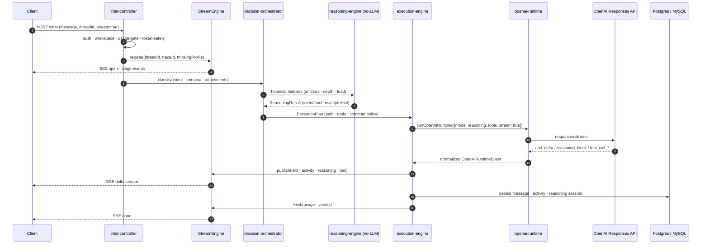
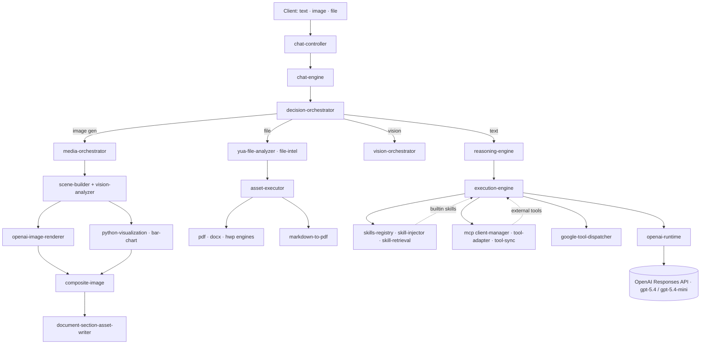

# YUA Backend

Multi-runtime AI backend for YUA. Chat, reasoning, agents, multimodal, MCP, skills — all in one TypeScript service.

`TypeScript` · `Node 20` · `Express` · `Postgres` · `MySQL` · `Redis` · `OpenAI Responses API` · `MCP`

> Solo build. 4 months. ~1,500 files. Powering production.
>
> 🇰🇷 [한국어 README](./README.ko.md)

---

## What's inside

This is not a wrapper around `openai.chat.completions`. It's the full pipeline from HTTP entry to LLM token stream, written from scratch, with these modules separated:

- **Chat entry** — `chat-controller` accepts `POST /chat` and opens an SSE session.
- **Six OutModes** — FAST · NORMAL · DEEP · SEARCH · RESEARCH · ENGINE_GUIDE, each routed to its own path handler in `chat-engine-router.ts`.
- **Decision Orchestrator** — single owner of intent, policy, path, and memory intent. ChatEngine doesn't classify; it compiles whatever the orchestrator decided.
- **Reasoning Engine** — zero LLM calls. Pure functions + weighted heuristics produce turn intent / depth / cognitive load / flow anchors.
- **Execution Engine** — owns the stream lifecycle, dispatches tools / skills / MCP, runs the verifier loop, decides continuation, dispatches multimodal.
- **OpenAI Runtime** — uses the new OpenAI **Responses API** (2026.01) with strict typing. Separate `system / developer / user`, `reasoning.effort` 6 levels, `verbosity` 3 levels, JSON schema output.
- **Multimodal** — image generation (semantic + chart composite), vision analysis, file analysis (pdf · docx · hwp · csv), markdown→pdf rendering.
- **Tools/Skills/MCP** — OpenAI built-ins, in-house yua-tools, MCP external tools, retrieval-based skill injection.
- **Telemetry & self-check** — raw event writer, failure surface aggregator, completion verdict engine, compute gate (cost / latency limits).

---

## How a request flows

### Streaming transport — SSE + Redis Pub/Sub

Streaming is **SSE (Server-Sent Events), not WebSocket**. We don't need bidirectional messaging (server → client only) and SSE plays well with proxies and CDNs.

The request and the receive path are split into two endpoints:

- `POST /chat` — submit a message. Responds with a job-started ack and returns.
- `GET /stream?threadId=X` — opens the SSE channel for that thread. Headers: `text/event-stream; charset=utf-8`, `Cache-Control: no-cache`, `X-Accel-Buffering: no` (disable nginx buffering). A `: ping` keep-alive is sent every 15 seconds.

This split gives us:

- Refresh and resume — re-open `/stream` with the same `threadId` and you pick up where the response was
- Mobile background — the server keeps working; the client re-subscribes when it returns
- Multi-device — the same thread can be subscribed from several devices at once

**Horizontal scaling via Redis Pub/Sub**

When PM2 runs multiple instances, the `POST /chat` handler and the `GET /stream` handler may live on different processes. In-memory delivery alone can't bridge them, so `StreamEngine.publish` writes to two places at once:

1. **in-memory subscribers** — SSE handlers on the same instance (fastest)
2. **Redis publisher** — publishes to channel `yua:stream:${threadId}`

On other instances, `redisSub` is subscribed to the same channel. When a message arrives, it fans out to that instance's in-memory subscribers, which then write SSE frames. The SSE handler only ever talks to its local in-memory map.

```
[Instance A] POST /chat ─┐
                         │ StreamEngine.publish
                         ├─→ in-memory subs (A)
                         └─→ redisPub.publish("yua:stream:42")
                                       │
                            [Instance B] redisSub.on("message")
                                       │
                                       └─→ in-memory subs (B)
                                                  │
                                                  └─→ SSE write to client
```

**Redis as a cache**

Beyond Pub/Sub, Redis is used for explicit cache keys:

- `yua:thread_title:cache:${threadId}` — thread title cache. We only `SET` after the DB write succeeds, to avoid cache/DB drift. Reads check Redis first.
- `yua:activity_title:jobs` — async queue for activity title generation. A worker pulls from this stream key and processes.
- `yua:activity_title:patch:${threadId}` — separate channel that pushes title patches into the same SSE stream.

The stream session itself (state machine, AnswerBuffer, reasoning buffer) lives in memory. Redis only handles cross-instance broadcast and explicit cache keys — we don't fetch state from Redis on hot paths.

**One UTF-8 quirk**

Korean characters are 3 bytes in UTF-8. If `res.write()` is called twice (e.g., separately for `event:` and `data:`), a multi-byte char can split at the chunk boundary and the client's ReadableStream sees broken UTF-8. We concatenate the whole SSE frame into a single string, then `Buffer.from(frame, "utf-8")` and write once.

### One text chat turn — step by step



Walking through the diagram:

1. **Request entry (`chat-controller.handleChat`)**
   The client sends `POST /chat`. With `stream: true`, we go into SSE mode. The controller mints a `traceId` (UUID) so every log and event downstream carries the same id.

2. **Auth · workspace · usage check**
   `req.user` and `req.workspace` are validated, then `usage-gate` checks the workspace's billing limit and `token-safety` makes sure the input doesn't blow the context window. Any failure short-circuits with 401/402/413 before the SSE session opens.

3. **Attachment recovery**
   Even if the new request has no attachments, we look up the previous turn's attachment session via `file-session-repository`. This lets follow-ups like "summarize the file I uploaded earlier" work without a re-upload.

4. **Register the SSE session (`StreamEngine.register`)**
   Registers a session with `threadId · traceId · thinkingProfile`. From this point the client receives `event: stage` events in real time as the work progresses.

5. **DecisionOrchestrator**
   Takes the message, persona, attachment metadata, workspace context, and decides:
   - turn intent (question / reaction / continuation / shift)
   - response path (FAST / NORMAL / DEEP / SEARCH / RESEARCH / ENGINE_GUIDE)
   - memory intent (store this turn? recall what?)
   - tool gate (which tools are allowed here)
   - compute policy (model · reasoning effort · verbosity)

6. **ReasoningEngine — no LLM**
   The orchestrator calls `ReasoningEngine` synchronously. Weighted heuristics plus code-AST and math-graph features produce flow anchors (9 types like `VERIFY_LOGIC`, `IMPLEMENT`, `BRANCH_MORE`), depth hint, and cognitive load. Because there's no LLM here, this stage is deterministic, fast, and free.

7. **Build the ExecutionPlan**
   The decision is wrapped into an `ExecutionPlan` that flows through ChatEngine to ExecutionEngine. Once built, the plan is read-only. Downstream modules consume it; nobody re-decides.

8. **Tool assembly in ExecutionEngine**
   - Hit `tool-assembly-cache` (60s TTL, since tools rarely change mid-conversation)
   - Assemble OpenAI built-ins (web_search, etc.) + yua-tools + active MCP tools + Google tools
   - Skill retrieval (`skill-retrieval` → `skill-injector`) picks top-N skills relevant to the message and injects them into the system prompt

9. **OpenAI Responses API call (`runOpenAIRuntime`)**
   Pick the model based on OutMode (`gpt-5.4-mini` for FAST, `gpt-5.4` for everything else), set `reasoning.effort` · `verbosity` · output format (text or json_schema), and call `responses.stream`. Not `chat.completions` — the new Responses API.

10. **Event normalization + SSE publish**
    Responses API server events come back. We normalize into:
    - `text_delta` — answer token deltas
    - `reasoning_block` / `reasoning_summary_delta` — reasoning blocks (kept separate from answer)
    - `tool_call_started/arguments_delta/done/output` — tool call lifecycle
    - `activity` — incidental activity (e.g., web_search invocation)
    - `usage` — token accounting
    Each event goes through `StreamEngine.publish` to SSE. Reasoning blocks are split from the answer stream so the UI can render them in a separate panel.

11. **Tool call handling**
    When the LLM calls a tool, `tool-runner` → dispatcher (built-in / yua-tools / MCP / Google) executes it and the result goes back to the LLM to continue the response. Citations are parsed in-stream by `createCitationStreamParser` and emitted as source chips alongside the text.

12. **Verifier loop + continuation**
    After the response ends, `runVerifierLoop` checks output quality and retries if it falls short. If the response was cut off, `continuation-decision` → `buildContinuationPrompt` reconstructs the prompt and continues.

13. **Persist + finish**
    The final response is written to Postgres (`message · activity · reasoning_session · asset` tables). In the same transaction `updateConversationSummary` updates the conversation summary so the next turn can start with a shorter context. Finally `StreamEngine.finish` emits SSE `done` and cleans up. Every catch path in the controller calls `finish()`, so zombie sessions don't pile up.

### Multimodal (image generation · vision · files)



The orchestrator splits on input type:

- **Image generation** — `media-orchestrator` takes two paths. Pure-semantic prompts go through `scene-builder` → `openai-image-renderer`. If the prompt comes with structured data (`computed.series`), a Python visualization script (`bar-chart`) renders the chart and `composite-image` merges them. Identical inputs are deduped by hash (`findCompositeByHash`).
- **Vision analysis** — `vision-orchestrator` analyzes attached images, either as a hint into scene construction or as a standalone analysis.
- **File analysis** — `yua-file-analyzer` dispatches to per-extension engines (pdf · docx · hwp · csv). Output can be re-rendered to PDF via `markdown-to-pdf`.

Stage events like `StreamEngine.publish({event: "stage", stage: ANALYZING_IMAGE})` are emitted to SSE in real time so the UI can show progress per stage.

---

## Design notes

### Stream Engine

Streams are produced from one place. The controller only registers and finishes the session; everything else goes through the engine. Manual token chunking, fake "streaming" via publish loops, and any path that bypasses ExecutionEngine for text generation are blocked at the code level. Once you let zombie sessions slip, debugging becomes a nightmare, so I locked the lifecycle early.

Lifecycle: `register → publish (stage / text_delta / activity / tool / reasoning) → finish (usage / verdict)`. Every catch branch calls `finish()`.

### Decision Orchestrator

`decision-orchestrator.ts` owns intent / policy / path / memory intent. ChatEngine, ExecutionEngine, and other modules consume the result; they don't re-classify. Learning only shifts thresholds — no rule mutation, no model retraining. Every effect is logged via `RAW_EVENT` so it can be inspected after the fact.

### Reasoning Engine — no LLM

`reasoning-engine.ts` deliberately makes zero LLM calls. It's not even async. Weighted heuristics produce:

- turn intent (`QUESTION`, `REACTION`, `AGREEMENT`, `CONTINUATION`, `SHIFT`)
- depth hint (`shallow` / `normal` / `deep`)
- cognitive load (`low` / `medium` / `high`)
- flow anchors (9 types: `VISION_PRIMARY`, `REFINE_INPUT`, `EXPAND_SCOPE`, `VERIFY_LOGIC`, `COMPARE_APPROACH`, `IMPLEMENT`, `SUMMARIZE`, `NEXT_STEP`, `BRANCH_MORE`)

Code input runs through `code-ast-engine`, math input through `math-graph-engine`, both feeding additional features. Anchors are advisory — they don't force anything and don't generate text.

Keeping this LLM-free makes it fast, deterministic, and free.

### OpenAI Responses API

`openai-runtime.ts` uses the official Responses API types (`ResponseCreateParamsStreaming`, `ResponseTextDeltaEvent`, `ResponseFunctionCallArgumentsDeltaEvent`, etc.) — not `chat.completions`.

- Models: `gpt-5.4-mini` (FAST), `gpt-5.4` (NORMAL/SEARCH/DEEP/RESEARCH)
- `reasoning.effort`: `none` / `minimal` / `low` / `medium` / `high` / `xhigh`
- `reasoning.summary`: `auto` / `concise` / `detailed`
- `verbosity`: `low` / `medium` / `high`
- Output format: text or `json_schema` (strict supported)
- Reasoning tokens and answer tokens are emitted on separate channels — reasoning never leaks into the answer stream.

### Execution Engine

`execution-engine.ts` is the ~4K line execution core.

- **Stream lifecycle** ends in order: FINAL → DONE → CLEANUP.
- **Tool routing** — built-in / yua-tools / MCP / Google tools all go through one dispatcher.
- **Verifier loop** — `runVerifierLoop` checks output quality and retries when needed.
- **Continuation** — `continuation-decision` decides if the response was cut off; `buildContinuationPrompt` reconstructs the prompt and continues.
- **Tool assembly cache** — 60s TTL; tools rarely change mid-conversation.
- **Citation parser** — `createCitationStreamParser` extracts citations in-stream and emits them as source chips.
- **Activity aggregator** — collects tool calls, web searches, file reads in one place.

### Compute Gate & Token Safety

Every request passes through gates before reaching the LLM:

- `usage-gate` — workspace billing limit
- `compute-policy` — model / reasoning effort / allowed tools as policy
- `compute-gate` — concurrency / latency / cost ceilings
- `token-safety` — block before prompt tokens overflow the context window

### Tools / Skills / MCP

- **OpenAI built-in tools** — `openai-tool-registry` builds the schema and enables hosted tools like `web_search`.
- **MCP** — `mcp/client-manager` handles per-user sessions, `tool-adapter` converts MCP tools into OpenAI tool schemas, `tool-sync` decides which tools are active per thread.
- **Skills** — `skills-registry` (definitions) → `skill-retrieval` (top-N search) → `skill-injector` (system prompt injection).
- **Google** — `google-tool-dispatcher` integrates Gmail · Calendar · Drive.

---

## Memory and context injection

### Memory layers (4 tiers)

`src/ai/memory/index.ts` exposes the memory hub:

- **Short** (`ShortMemoryEngine`) — short-term memory within the same thread. Key facts from recent turns.
- **Long** (`LongMemoryEngine`) — long-term per-user memory. Persona, preferences, recurring context.
- **Cross** (`cross-memory-orchestrator`) — workspace-level memory across threads. Pulls in decisions made in other conversations.
- **Cache** (`FastCache`) — in-memory cache on the hot path; we don't hit DB every turn.
- **Vector sync** (`MemoryVectorSync`) — embeds memory text so it's searchable.

`MemoryAction` has five variants — `NONE` / `SHORT` / `LONG` / `PROFILE` / `PROJECT`. DecisionOrchestrator decides `memoryIntent`; `map-intent-to-action` translates that into the actual write target.

Workspace-scoped memory rules are cached in-memory by `memory-rule-context.ts`. Only restart or an explicit admin call invalidates it, so the hot path cost is essentially zero.

### Cross-thread memory attachment

`CrossMemoryOrchestrator.attach()` only attaches memory from other threads when all of these pass:

- `turnIntent !== "SHIFT"` (don't attach on a topic shift)
- `anchorConfidence >= 0.6` (avoid noisy attachment)
- `responseMode === "ANSWER"` (skip other modes)
- `workspaceId` and `userId` exist

Type defaults to `USER_LONGTERM`; if `intent === "decide" && confidence >= 0.85`, `DECISION` is added as well. Attached memory is **reference only** — never instruction. No vector search is used; this is deterministic attachment driven by DecisionContext.

`CrossMemorySummarizer` is also LLM-free and deterministic. Routing verdicts (`APPROVE` / `REJECT` / `FALLBACK`) are engine-internal and never stored — only substantive user-facing decisions become memory.

### Context Runtime — the brain of memory / conversation / continuity

`context-runtime.ts` is the core module that decides what memory and conversation context are weighted into the next turn. The constitution is in the file header:

- RAW memory is an inertia signal, not a fact. Don't treat it as truth.
- `QUESTION` always re-decides. Memory doesn't lock in an answer.
- RAW carry is allowed only in `CONTINUATION`.
- `conversationState` (summary) is always allowed.
- General memory is conditionally allowed in follow-up questions.
- `SHIFT` is the only trigger that weakens context.
- **No exclusion, only degradation** — memory is never cut off; weights are lowered.

#### Processing order

1. **Self memory gate**
   If `isSelfInquiry === true`, fetch self constitution via `MemoryManager.getSelfMemory()`. Keep the body in the system prompt; only inject `[SELF_MEMORY_REF key=... v=...]` as a constraint at runtime (token-efficient).

2. **Turn guards**
   - `hasThread` — does a thread exist
   - `isLargeInput` — `userMessageLength > 3000` (suspect code/large paste)
   - `isCodeInput` — large + length guard

3. **Conversation context build**
   `buildConversationContext(threadId, 20)` fetches the last 20 turns plus the summary, then `classifyConversationTurns()` tags each turn as a SemanticTurn. If any user turn has `relation.dependsOnPrev === true && relation.relationType === "FOLLOW_UP"`, set `isSemanticContinuation = true`.

4. **anchorConfidence calculation** (additive, capped at 1.0)
   ```
   base                                          = 0     (+0.55 if a lastAssistantTurn exists)
   userMessageLength <= 14 (short follow-up)     += 0.45
   turnIntent === "CONTINUATION"                 += 0.35
   isSemanticContinuation                        += 0.20
   QUESTION + length <= 25 (Continuity Stabilizer) += 0.25
   ```
   GPT-style — shorter follow-ups are treated as stronger continuity signals.

5. **Graph continuation override**
   `ThreadSemanticStateRepository.get(threadId)` retrieves the active topic. `shouldForceContinuation()` checks if the new message belongs to it. If yes, set `graphForcedContinuation = true` and bump `anchorConfidence = max(current, 0.75)`. SHIFT forces no override.

6. **continuityAllowed / allowHeavyMemory**
   ```
   continuityAllowed = (anchorConfidence >= 0.35 OR affordanceBias) AND turnIntent !== "SHIFT"
   allowHeavyMemory  = hasThread AND turnIntent !== "SHIFT" AND !isCodeInput
   ```

7. **contextCarryLevel branching** — how deeply to carry context to the next turn
   ```
   isContinuation && continuityAllowed         → "SEMANTIC"
   QUESTION + anchorConfidence >= 0.3          → "SEMANTIC"  (weak continuity preserve)
   else                                         → "ENTITY"
   conversationState looks like generated explanation → forced "ENTITY"
   ```

8. **effectiveTurns slicing**
   Drop `SOCIAL_NOISE`. On SHIFT, only the first turn. On continuation, last 6 turns; otherwise last 4. Assistant messages over 500 chars get truncated.

9. **Unified memory load**
   `loadUnifiedMemory({workspaceId, userId, threadId, mode, allowHeavyMemory})` returns:
   - `userContext` (always, scope=personal)
   - `projectContext` (architecture, scope=domain)
   - `decisionContext` (decision)
   - `crossThreadContext` (cross-thread)

10. **Selection limits** — `MAX_CONVERSATION_CHUNKS = 11`, `MAX_MEMORY_CHUNKS = 8` to prevent prompt blowup.

### Context Merger — weighted merge

`context-merger.ts` merges Context Runtime output with search results into one payload.

#### 1. Trusted Facts — official sources only, score-sorted

```
score = relevance * 0.6 + (trust / 5) * 0.4
```

Search results pass through `isOfficialDocSource()` filter, then sorted descending and emitted as `(1) snippet\nSource: ...`. Untrustworthy sources don't make it into trustedFacts.

#### 2. Memory chunks — weighted merge (GPT-style)

Each memory chunk gets a weight by scope:

```
scope === "summary"            → weight 3
scope === "general_knowledge"  → weight 2
scope === "domain" | "personal" → weight 1.5
scope === "public"             → weight 1
```

Sort descending by weight, then cap by carry level:

```
contextCarryLevel === "ENTITY"   → 6 chunks
contextCarryLevel === "SEMANTIC" → 8 chunks
default (RAW)                    → 12 chunks
designMode === true              → +2 (max 10)
```

#### 3. Pending context

If a previous turn left a `baseQuestion` unanswered, append `[PENDING QUESTION]\n...`. If the user provided extra detail, also append `[USER PROVIDED DETAIL]\n...`.

#### 4. Final payload

```
[CONTEXT LEVEL]
ENTITY | SEMANTIC | RAW

[CONVERSATION STATE]
accumulated summary text

• memory chunk 1
• memory chunk 2
...
```

This becomes `userContext` for prompt-runtime, injected near the system prompt. `trustedFacts` is a separate block, keeping citation-grade facts cleanly separated from general context.

### Conversation summary update

`ConversationSummaryEngine` only fires when:

- After `StreamEngine.publish(event: "done")`
- `verdict === APPROVE`
- `mode ∈ ["DEEP", "DESIGN", "ARCHITECTURE"]`
- 12+ accumulated messages

If the conditions match, gpt-4.1-mini generates a short summary (max_tokens=300) and UPSERTs into Postgres `conversation_summaries`. Summary rule: "facts / decisions / design only — drop chitchat." Substantive decisions get promoted to workspace memory (`Architecture` or `Decision` type).

### Continuity Capsule

`src/ai/prompt/continuity-capsule.ts` packages cross-turn continuity. It compresses the previous turn's key facts, open questions, and next-step anchors into a small capsule injected into the next turn's prompt. Short and deterministic — minimal tokens, no broken flow.

### Prompt assembly (PromptRuntime)

`prompt-runtime.ts` assembles everything above into the final prompt. `PromptRuntimeMeta` carries:

- `conversationTurns` — recent dialog from the context builder
- `memoryContext` · `referenceContext` · `trustedFacts` — output of memory + context merger
- `attachments` — multimodal hint (image/audio/video/file metadata). **Read-only**. Doesn't influence judgment, decision, or memory.
- `signals` — `yua-signal` signals (system-detected user state)
- `toneBias` — DecisionContext tone bias
- `constraints` — constraints to apply
- `anchorConfidence` · `continuityAllowed` · `contextCarryLevel` — continuity meta
- `responseDensityHint` — output density (COMPACT / NORMAL / EXPANSIVE)
- `conversationalOutcome` — conversational outcome intent
- `designHints` — design observations (reference only, never instruction)
- Persona block — `renderUserProfileBlock` injects user profile
- Skills block — `retrieveTopSkills` → `renderSkillsBlock` injects top-N skill text into the system prompt
- Code context — `StructuredCodeIngest` injects structured code
- File RAG — file-intel vector embedder retrieves attachment chunks

When done, `PromptBuilder` (or `PromptBuilderDeep` in DEEP mode) renders the final string. None of these hints are forced as instructions — the user message always has top authority.

---

## DB layout

| Role | Engine | Used for |
|------|--------|----------|
| Main store | **Postgres** (`pgPool`) | messages · threads · reasoning sessions · assets · workspaces |
| Read replica | `pg-readonly` | recent message lookups and other read-heavy queries |
| Some domains | **MySQL** (`pool`) | a few backend tables |
| Cache / session | **Redis** | stream session bridge · rate limit · cache keys |
| Vector | Postgres + `createOpenAIEmbedder` | file RAG · skill retrieval |
| Migrations | `migrations/` SQL | schema changes |

`updateConversationSummary` runs at end of turn to refresh the conversation summary so the next turn starts with a shorter context. `file-session-repository` persists attachment sessions so follow-up turns can refer to the same files.

---

## Module map

| Path | Role |
|------|------|
| `src/control/chat-controller.ts` (~1.3K lines) | HTTP entry, auth, SSE register, dependency wiring |
| `src/routes/stream-router.ts` | `GET /stream` SSE endpoint |
| `src/ai/chat/chat-engine-router.ts` | OutMode → 6 path dispatch |
| `src/ai/engines/chat-engine.ts` (~2.3K lines) | path dispatch and response composition |
| `src/ai/decision/decision-orchestrator.ts` (~1.9K lines) | intent / policy / path / memory intent |
| `src/ai/reasoning/reasoning-engine.ts` | pure-function reasoning, anchor / depth / load |
| `src/ai/execution/execution-engine.ts` (~4.2K lines) | stream lifecycle, tool / skill / MCP execution |
| `src/ai/chat/runtime/openai-runtime.ts` (~1.2K lines) | OpenAI Responses API call + event normalization |
| `src/ai/chat/runtime/prompt-runtime.ts` (~1.1K lines) | prompt assembly, persona / skills / RAG injection |
| `src/ai/image/media-orchestrator.ts` | multimodal dispatch |
| `src/ai/asset/execution/` | document (pdf/docx/hwp) + image asset pipelines |
| `src/connectors/mcp/` | MCP client, tool adapter, tool sync |
| `src/skills/` | skills registry · retrieval · injector |
| `src/agent/security/` | sandbox, secret detection, audit logger |
| `src/ai/engines/stream-engine.ts` | SSE stream session manager + Redis bridge |
| `src/db/redis.ts` | Redis pub / sub / cache helpers |
| `src/ai/compute/` | compute-policy · compute-gate (cost control) |
| `src/ai/selfcheck/` | completion-verdict-engine · failure-surface-engine |
| `src/ai/telemetry/` | raw-event-writer · failure-surface-writer |

7 runtimes live under `src/ai/chat/runtime/` — chat · code · context · image · safety · openai · prompt.

## Self-QA

`qa-reports/2026-04-22/` — six per-module audits:

- `01_openai_runtime.md`
- `02_prompt_builder.md`
- `03_prompt_runtime.md`
- `04_context_runtime.md`
- `05_chat_engine.md`
- `06_execution_engine.md`

---

## Stack

- **Runtime** Node 20, TypeScript 5
- **Web** Express, Swagger, cookie-parser
- **Storage** Postgres (main) + MySQL (some domains) + Redis
- **AI** OpenAI Responses API, MCP, in-house reasoning/decision/execution engines
- **Process** PM2 (`ecosystem.config.js`), Docker

## Project shape

```
src/
  ai/
    chat/         7 runtimes + engine + router + 6 paths
    decision/     decision orchestrator + assistant + affordance
    reasoning/    reasoning engine + self-check + drift + session
    execution/    execution engine + verifier + continuation
    image/        media orchestrator + scene + render + composite
    vision/       vision orchestrator + analyzer
    asset/        document(pdf/docx/hwp) + image pipelines
    memory/       cross-memory + runtime memory
    selfcheck/    completion verdict + failure surface
    compute/      policy + gate
    telemetry/    raw event + failure aggregator
    tools/        openai-tool-registry + tool-runner
  agent/          executor + session manager + security
  control/        HTTP controllers
  connectors/
    mcp/          client-manager + tool-adapter + tool-sync
    google/       google-tool-dispatcher
    oauth/        token-store
  skills/         registry + retrieval + injector + builtin
  routes/         route definitions + path-router + stream-router
  db/             postgres + mysql + pg-readonly + redis + repositories
qa-reports/       per-module self-audit
data/training/    training data exports
migrations/       SQL migrations
```

---

## Status

Not OSS yet. Production code; opening parts of the system. License pending.

## About

I built this end to end — `chat-controller` to `openai-runtime`, image generation, file analysis, MCP, skills, decision, reasoning, the verifier loop. One person, four months.

If you're hiring for this kind of work or want to collaborate on something similar, feel free to reach out via GitHub Issues or email.
