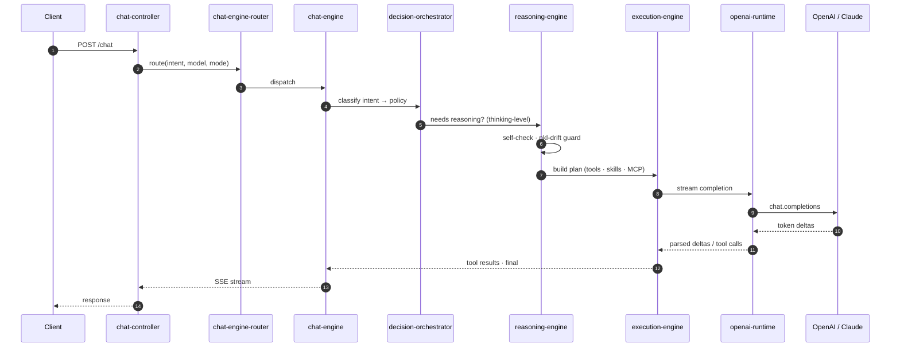
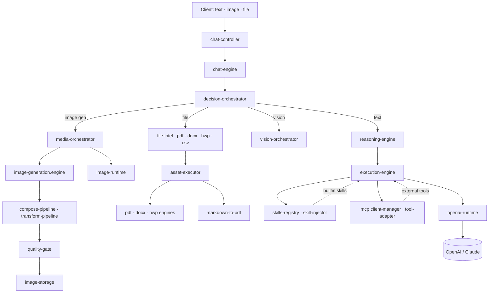

# YUA Backend

Multi-runtime AI backend. Chat, reasoning, agents, multimodal, MCP, skills — all in one TypeScript service.

`TypeScript` · `Node 20` · `Express` · `Postgres` · `Redis` · `OpenAI` · `MCP`

> Solo build. 4 months. ~1,500 files. Powering [YUA](https://github.com/yuaone).
>
> 🇰🇷 [한국어 README](./README.ko.md)

---

## What it does

- **Chat** — streaming, multi-engine routing, legacy adapter
- **Reasoning** — self-check, drift guard, configurable thinking levels
- **Agents** — sandboxed execution, secret detection, audit logging
- **Multimodal** — image gen, vision, file analysis (pdf · docx · hwp · csv)
- **Tools** — MCP client, built-in skills, retrieval injection
- **OpenAI runtime** — streaming completions, tool calls, function payloads

Not a wrapper. The full pipeline from HTTP entry to LLM token stream is in this repo.

---

## Architecture — text request



## Architecture — multimodal request



---

## Core modules

| Path | What it does |
|------|--------------|
| `src/control/chat-controller.ts` | HTTP entrypoint, SSE streaming |
| `src/ai/chat/chat-engine-router.ts` | Engine selection by intent / model |
| `src/ai/engines/chat-engine.ts` | Main chat dispatch |
| `src/ai/decision/decision-orchestrator.ts` | Intent → policy mapping |
| `src/ai/reasoning/reasoning-engine.ts` | Self-check, pkl-drift, thinking-level |
| `src/ai/execution/execution-engine.ts` | Tool / skill / MCP execution |
| `src/ai/chat/runtime/openai-runtime.ts` | OpenAI streaming runtime |
| `src/ai/chat/runtime/prompt-runtime.ts` | Prompt assembly runtime |
| `src/ai/image/media-orchestrator.ts` | Multimodal dispatch |
| `src/ai/asset/execution/` | Document & image asset pipelines |
| `src/connectors/mcp/` | MCP client, tool adapter, prompt builder |
| `src/skills/` | Skills registry, retrieval, injector |
| `src/agent/security/` | Sandbox, secret detection, audit logger |

7 runtimes under `src/ai/chat/runtime/` — chat · code · context · image · safety · openai · prompt.

## Self-QA

`qa-reports/2026-04-22/` — 6 modules audited:
- `01_openai_runtime.md`
- `02_prompt_builder.md`
- `03_prompt_runtime.md`
- `04_context_runtime.md`
- `05_chat_engine.md`
- `06_execution_engine.md`

---

## Stack

- **Runtime** Node 20, TypeScript 5
- **Web** Express, Swagger
- **Storage** Postgres, MySQL, Redis
- **AI** OpenAI SDK, MCP, custom runtimes
- **Process** PM2, Docker

## Project shape

```
src/
  ai/
    chat/         # 7 runtimes + engine + router
    decision/     # decision orchestrator + assistant
    reasoning/    # reasoning engine + self-check + drift
    execution/    # execution engine
    image/        # media orchestrator + vision
    asset/        # document + image pipelines
    memory/       # cross-memory, runtime memory
  agent/          # executor, session manager, security
  control/        # HTTP controllers
  connectors/mcp/ # MCP client + tool adapter
  skills/         # registry + retrieval + injector
  routes/         # route definitions
qa-reports/       # self-audit per module
data/training/    # training data exports
migrations/       # SQL migrations
```

---

## Status

Not OSS yet. Production code, opening up parts of the system. License pending.

## About

I built this end to end. The full thing — from `chat-controller` to `openai-runtime`, plus image gen, file analysis, MCP, skills — is one person, four months. If you're hiring backend / AI runtime / agent infra, ping me.
